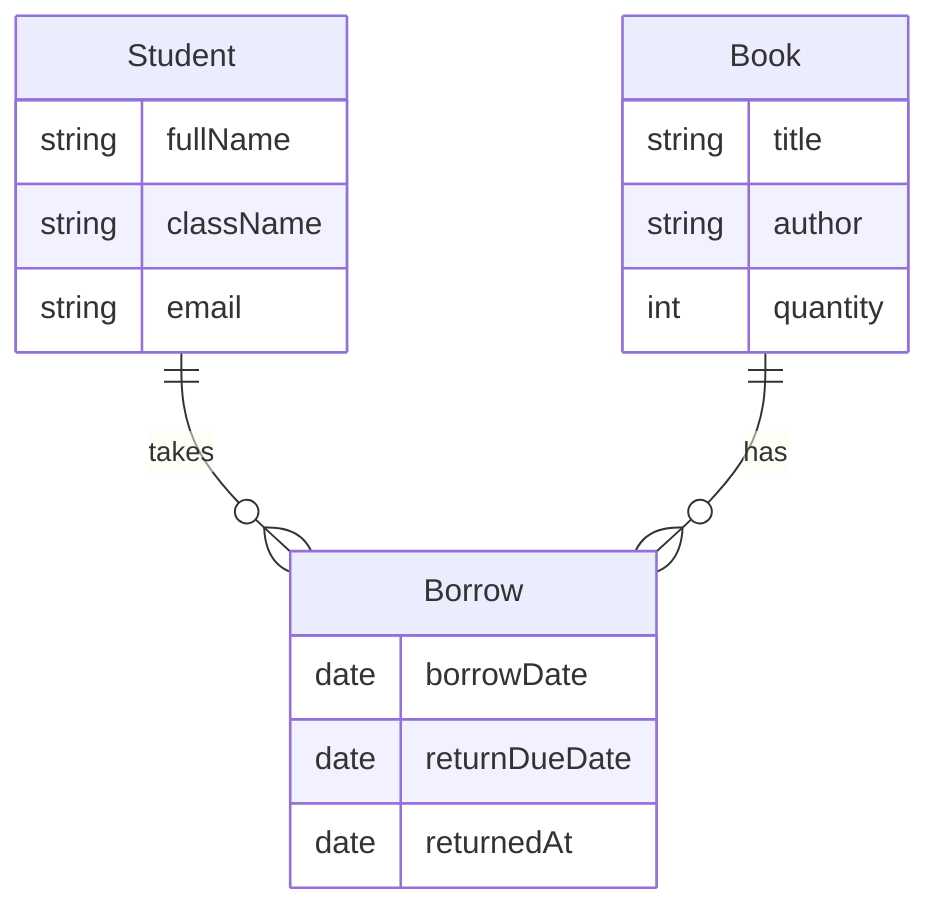

# Library Management System (LMS)

A small web app for a school library: books, students, borrowing, returns, and reports. You need **Node.js** and **MongoDB** installed on your computer.

---

## How to run it (two terminals)

**1. Start MongoDB**  
If you use MongoDB as a service, start it. The app expects a database on your machine (default: `mongodb://127.0.0.1:27017/lms`).

**2. Backend (API)**

```bash
cd lms/backend
npm install
npm run dev
```

On startup the server runs a **seed** step (safe to run every time):

| What gets added | When |
| ----------------- | ---- |
| Accounts `admin` and `librarian` | Only if those usernames do not exist yet |
| **2 demo students** and **2 demo books** | Only if the database has **zero** students and **zero** books |

So your first launch on an empty database gives you accounts plus sample rows to try borrowing and reports. If you already have data, nothing extra is duplicated. You usually do **not** need `npm run seed`; that command only repeats the same seed if you run it manually.

**3. Frontend (website)**

```bash
cd lms/frontend
npm install
npm run dev
```

**4. Open the app in your browser**

Go to: **http://localhost:5828**

The API runs on **http://localhost:5827** (the website talks to it automatically).

---

## Demo logins (after you run the backend once)

Use these only for practice or class demos. Change them in a real deployment.

| Who        | Username     | Password      |
| ---------- | ------------ | ------------- |
| Admin      | `admin`      | `admin123`    |
| Librarian  | `librarian`  | `librarian123` |

- **Admin** can add and edit students and books, and use all features.  
- **Librarian** can borrow and return books, search, and print reports.

**Sample students** (when auto-seeded): Marie Uwase (`marie.demo@school.test`), David Nkurunziza (`david.demo@school.test`).  
**Sample books**: *Computer Science Basics*, *Stories for Young Readers*.

---


## Diagram (how data connects)


