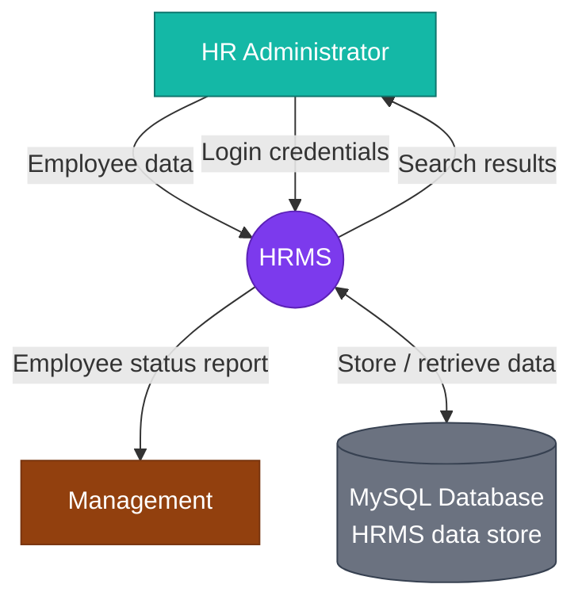

# Human Resource Management System (HRMS)

Web-based HRMS to centralize employee management, reduce duplication, and support reporting.

## Stack

| Layer | Technology |
|-------|------------|
| Frontend | React + Vite + Tailwind (port **5173**) |
| Backend MySQL | Express + mysql2 + express-session + JWT (port **5555**) |
| Backend MongoDB | Express + Mongoose (port **5555**, optional alternative) |

Run **one backend at a time** (same port).

## Quick start

**MySQL**

```bash
cd hrms/backend-mysql && cp .env.example .env && npm install && npm run db:init && npm run dev
cd hrms/frontend && npm install && npm run dev
```

If upgrading an existing database with old status values:

```bash
mysql -u root -p HRMS < hrms/backend-mysql/database/migrate_status_enum.sql
```

Open http://localhost:5173 and sign in with a user account from the `users` table.

## Features

| Feature | Implementation |
|---------|----------------|
| MySQL database **HRMS** | `backend-mysql/database/schema.sql` |
| ERD with PK/FK | Below + [backend-mysql/README.md](backend-mysql/README.md) |
| Level 0 DFD (Context Diagram) | Below |
| CRUD + search employees | `GET/POST/PUT/DELETE /api/employees`, `GET /api/employees/search?q=` |
| Session + JWT authentication | Login sets **session cookie** (`hrms.sid`) and returns **JWT**; API accepts either |
| Employee Status Report | `GET /api/reports/on-leave` — on leave only, grouped by department with totals |
| Responsive UI | Tailwind layout (sidebar + mobile-friendly tables) |

### Employee statuses

`Active`, `On Leave`, `Left`, `Blacklisted`, `Deceased`, `On Mission`

### Authentication

- **Session**: HTTP-only cookie after `POST /api/auth/login` (used with `withCredentials: true` on the frontend).
- **JWT**: Returned in login response; sent as `Authorization: Bearer <token>` on API calls.
- Protected routes accept **either** a valid session or a valid JWT.
- **Logout**: `POST /api/auth/logout` destroys the server session.

---

## Entity Relationship Diagram (ERD)

```mermaid
erDiagram
  DEPARTMENTS ||--o{ EMPLOYEES : "has (1:N)"
  POSITIONS ||--o{ EMPLOYEES : "assigns (1:N)"
  EMPLOYEES ||--o| USERS : "has account (1:1)"

  DEPARTMENTS {
    int department_id PK
    varchar depart_name UK "DepartName"
  }

  POSITIONS {
    int position_id PK
    varchar pos_name UK "PosName"
    varchar required_qualification "RequiredQualification"
  }

  EMPLOYEES {
    int employee_id PK
    varchar emp_first_name "EmpFirstName"
    varchar emp_last_name "EmpLastName"
    enum emp_gender "EmpGender"
    date emp_date_of_birth "EmpDateOfBirth"
    varchar emp_email UK "EmpEmail"
    varchar emp_telephone "EmpTelephone"
    varchar emp_address "EmpAddress"
    date emp_hire_date "EmpHireDate"
    enum emp_status "EmpStatus"
    int department_id FK
    int position_id FK
  }

  USERS {
    int user_id PK
    varchar user_name UK "UserName"
    varchar password "Password (bcrypt)"
    int employee_id FK UK
  }
```

### Business rules

1. An employee belongs to **one** department (`employees.department_id` → `departments`).
2. A department has **many** employees.
3. An employee holds **one** position (`employees.position_id` → `positions`).
4. A position is held by **many** employees.
5. A user is linked to **one** employee (`users.employee_id` UNIQUE).
6. Each employee has **at most one** user account.

---

## Level 0 DFD — Context Diagram

The context diagram shows the HRMS as a single central process, two external entities (HR Administrator and Management), and the MySQL data store.



### Legend

| Symbol | Meaning |
|--------|---------|
| Teal rectangle | External entity — **HR Administrator** |
| Brown rectangle | External entity — **Management** |
| Purple oval | System process — **HRMS** |
| Grey cylinder | Data store — **MySQL Database (HRMS data store)** |

### Data flows

| From | To | Data flow |
|------|-----|-----------|
| HR Administrator | HRMS | Employee data |
| HR Administrator | HRMS | Login credentials |
| HRMS | HR Administrator | Search results |
| HRMS | Management | Employee status report |
| HRMS | MySQL Database | Store / retrieve data |

---

## API overview

| Method | Endpoint | Description |
|--------|----------|-------------|
| POST | `/api/auth/login` | Session + JWT login |
| POST | `/api/auth/logout` | End session |
| GET | `/api/auth/me` | Current user (session or JWT) |
| GET | `/api/employees` | List employees |
| GET | `/api/employees/search?q=` | Search employees |
| POST | `/api/employees` | Create employee |
| PUT | `/api/employees/:id` | Update employee |
| DELETE | `/api/employees/:id` | Delete employee |
| GET | `/api/reports/on-leave` | On-leave report by department |

---

## Project structure

```
hrms/
├── README.md                 ← ERD, DFD, documentation
├── frontend/                 ← React UI
├── backend-mysql/            ← MySQL backend
└── backend-mongodb/          ← Optional MongoDB variant
```
