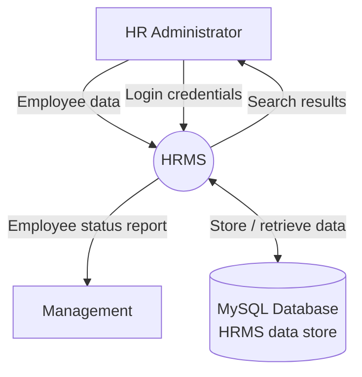

# Human Resource Management System (HRMS)

Web-based HRMS: Node.js + Express + React + MySQL. Matches the TSS National Integrated Assessment HRMS practical requirements for **software deliverables**.

## Exam requirements — software checklist

| # | Requirement | Status |
|---|-------------|--------|
| 1 | Employee statuses: **On Leave**, **Left**, **Blacklisted**, **Deceased**, **On Mission** | Done |
| 2 | ERD with **PK** and **FK** on relationships | Done (see below; submit paper copy separately) |
| 3 | **Level 0 DFD** (context diagram) | Done (see below; submit paper copy separately) |
| 4 | MySQL database **HRMS**: Employee, Department, Position, Users | Done — `backend-mysql/database/schema.sql` |
| 5 | **Node.js** backend + **React** frontend | Done |
| 6 | **CRUD** and **search** on records | Done — employees, departments, positions, users |
| 7 | **Responsive** web UI | Done — Tailwind, sidebar, mobile-friendly tables |
| 8 | **Session-based login** | Done — `express-session`, cookie `hrms.sid`, `withCredentials` |
| 9 | **Employee Status Report**: on leave only, **by department**, **totals** | Done — Reports → `GET /api/reports/on-leave` |

**You submit on paper:** hand-drawn ERD, Level 0 DFD, folder name `(FirstName_LastName_National_Practical_Exam_2026)`.

## Stack

| Layer | Technology |
|-------|------------|
| Frontend | React + Vite + Tailwind (port **5173**) |
| Backend MySQL | Express + mysql2 + express-session (port **5555**) |
| Backend MongoDB | Optional alternative (port **5555**) |

Run **one backend at a time**.

## Quick start

```bash
cd hrms/backend-mysql && cp .env.example .env && npm install && npm run db:init && npm run dev
cd hrms/frontend && npm install && npm run dev
```

Upgrade existing DB (removes legacy `Active` status):

```bash
mysql -u root -p HRMS < hrms/backend-mysql/database/migrate_status_enum.sql
```

Open http://localhost:5173 — sign in with a user from the `users` table (seeded `admin`).

## Features

| Feature | Implementation |
|---------|----------------|
| MySQL **HRMS** | `backend-mysql/database/schema.sql` |
| CRUD + search | All four entities in UI + API |
| Session login | `POST /api/auth/login` → session cookie; `POST /api/auth/logout` |
| Employee Status Report | On leave, grouped by department, per-dept and grand totals |
| User ↔ Employee | `users.employee_id` (a user is also an employee) |

### Employee statuses (exam list)

`On Leave`, `Left`, `Blacklisted`, `Deceased`, `On Mission`

### Authentication (session)

- Login: `POST /api/auth/login` — server sets **HTTP-only session cookie** `hrms.sid`.
- Frontend: `withCredentials: true` on all API calls.
- Logout: `POST /api/auth/logout` destroys the session.

**No public registration:** The practical exam asks for a **session-based login**, not open sign-up. The HR administrator adds user accounts in **Users** and links each account to one employee (`UserName`, `Password` per the ERD). Employees do not register themselves.

---

## Entity Relationship Diagram (ERD)

```mermaid
erDiagram
  DEPARTMENTS ||--o{ EMPLOYEES : "has (1:N)"
  POSITIONS ||--o{ EMPLOYEES : "assigns (1:N)"
  EMPLOYEES ||--o| USERS : "has account (1:1)"

  DEPARTMENTS {
    int department_id PK
    varchar depart_name UK "DepartName"
  }

  POSITIONS {
    int position_id PK
    varchar pos_name UK "PosName"
    varchar required_qualification "RequiredQualification"
  }

  EMPLOYEES {
    int employee_id PK
    varchar emp_first_name "EmpFirstName"
    varchar emp_last_name "EmpLastName"
    enum emp_gender "EmpGender"
    date emp_date_of_birth "EmpDateOfBirth"
    varchar emp_email UK "EmpEmail"
    varchar emp_telephone "EmpTelephone"
    varchar emp_address "EmpAddress"
    date emp_hire_date "EmpHireDate"
    enum emp_status "EmpStatus"
    int department_id FK
    int position_id FK
  }

  USERS {
    int user_id PK
    varchar user_name UK "UserName"
    varchar password "Password (bcrypt)"
    int employee_id FK UK
  }
```

### Business rules

1. An employee belongs to **one** department; a department has **many** employees.
2. An employee holds **one** position; a position has **many** employees.
3. A user is linked to **one** employee; each employee has **at most one** user account.

---

## Level 0 DFD — Context Diagram



| From | To | Data flow |
|------|-----|-----------|
| HR Administrator | HRMS | Employee data, login credentials |
| HRMS | HR Administrator | Search results |
| HRMS | Management | Employee status report (on leave) |
| HRMS | MySQL Database | Store / retrieve data |

---

## API overview

| Method | Endpoint | Description |
|--------|----------|-------------|
| POST | `/api/auth/login` | Session login |
| POST | `/api/auth/logout` | End session |
| GET | `/api/auth/me` | Current user |
| GET/POST/PUT/DELETE | `/api/employees` | Employee CRUD |
| GET | `/api/employees/search?q=` | Search employees |
| GET/POST/PUT/DELETE | `/api/departments` | Department CRUD |
| GET | `/api/departments/search?q=` | Search departments |
| GET/POST/PUT/DELETE | `/api/positions` | Position CRUD |
| GET | `/api/positions/search?q=` | Search positions |
| GET/POST/PUT/DELETE | `/api/users` | User CRUD |
| GET | `/api/users/search?q=` | Search users |
| GET | `/api/reports/on-leave` | Employee Status Report (on leave by department) |
| GET | `/api/reports?startDate=&endDate=` | Employees hired in date range |

---

## Project structure

```
hrms/
├── README.md
├── frontend/
├── backend-mysql/
└── backend-mongodb/   (optional)
```
